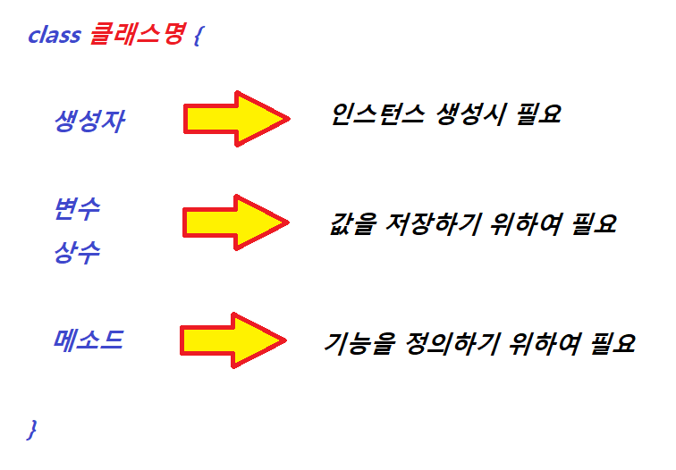

</img>

# 클래스(Class)
<pre>
  <code>
	하나의 객체(Object)를 만들기 위한 변수와 메소드의 집합이다.
	클래스는 일종의 어떤 형태를 만들기 위한 설계도와 같다.
	new 키워드를 이용하여 생성된 인스턴스 주소값을 변수 값으로 참조한다.
	생성된 인스턴스 주소값은  Heap area(힙 영역)의 주소값과 같다.
  </code>
</pre>

### 클래스 구조
</img>

----
# Table of Contents
##### [0. 개발 준비](../../../../../../)
##### [1. 자바(Java)](../java)
##### [2. 자료형(Data Type)](../datatype)
##### [3. 변수(Variable)](../variable)
##### [4. 주석(Comments)](../comments)
##### [5. 연산자(Operator)](../operator)
##### [6. 조건문(Conditional)](../conditional)
##### [7. 반복문(Iteration)](../iteration)
##### [8. 배열(Array)](../array)
##### [9. 메소드(Method)](../method)
#### 10. 클래스(Class)
##### [11. 패키지(Package)](../packages)
##### [12. 접근 제한자(Access Modifier)](../accessmodifier)
##### [13. 상속(Inheritance)](../inheritance)
##### [14. 추상(Abstract)](../abstracts)
##### [15. 인터페이스(Interface)](../interfaces)
##### [16. 예외 처리(Exception)](../exceptions)
##### [17. 참조(Reference)](../references)
##### [18. 제네릭(Generic)](../generics)
##### [19. 컬렉션(Collection)](../collections)
##### [20. 스트림(Stream)](../streams)
