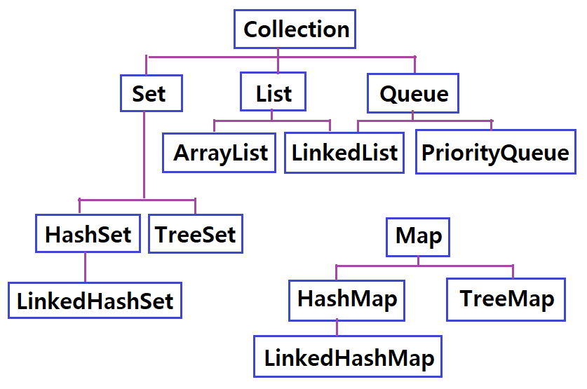

</img>

# 컬렉션(Collection)
<pre>
  <code>
	배열의 크기를 정의 하지 않고 배열을 구현 할 수 있도록 하는 자료구조를 말한다.
	자료구조(Data Structure)는 어떤 정보를 담는 것을 의미한다.
	여러 데이터를 담기 위한 방법이며 배열이 가장 기본적인 자료구조이다.
  </code>
</pre>

### 자바에서의 자료구조 유형
<pre>
  <code>
	순서가 있는 목록인 List형
	순서가 중요하지 않은 목록인 Set형
	먼저 들어온 것이 먼저 나가는 Queue형
	Key-Value의 형태로 저장되는 Map형
  </code>
</pre>
</img>

----
# Table of Contents
##### [0. 개발 준비](../../../../../../)
##### [1. 자바(Java)](../java)
##### [2. 자료형(Data Type)](../datatype)
##### [3. 변수(Variable)](../variable)
##### [4. 주석(Comments)](../comments)
##### [5. 연산자(Operator)](../operator)
##### [6. 조건문(Conditional)](../conditional)
##### [7. 반복문(Iteration)](../iteration)
##### [8. 배열(Array)](../array)
##### [9. 메소드(Method)](../method)
##### [10. 클래스(Class)](../classes)
##### [11. 패키지(Package)](../packages)
##### [12. 접근 제한자(Access Modifier)](../accessmodifier)
##### [13. 상속(Inheritance)](../inheritance)
##### [14. 추상(Abstract)](../abstracts)
##### [15. 인터페이스(Interface)](../interfaces)
##### [16. 예외 처리(Exception)](../exceptions)
##### [17. 참조(Reference)](../references)
##### [18. 제네릭(Generic)](../generics)
#### 19. 컬렉션(Collection)
##### [20. 스트림(Stream)](../streams)
