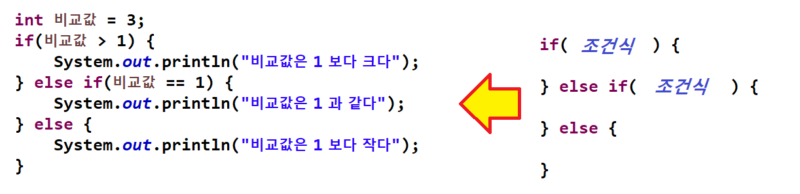
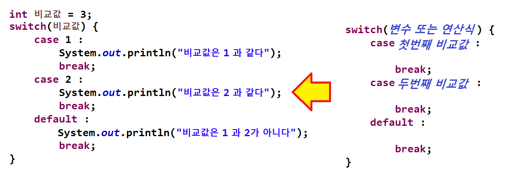

</img>

# 조건문(Conditional)
<pre>
  <code>
	비교를 통하여 논리형의 값을 기준으로 실행 흐름을 제어 하는 방법
	종류 : if문, switch문
  </code>
</pre>

### if문
</img>

### switch문
</img>

----
# Table of Contents
##### [0. 개발 준비](../../../../../../)
##### [1. 자바(Java)](../java)
##### [2. 자료형(Data Type)](../datatype)
##### [3. 변수(Variable)](../variable)
##### [4. 주석(Comments)](../comments)
##### [5. 연산자(Operator)](../operator)
#### 6. 조건문(Conditional)
##### [7. 반복문(Iteration)](../iteration)
##### [8. 배열(Array)](../array)
##### [9. 메소드(Method)](../method)
##### [10. 클래스(Class)](../classes)
##### [11. 패키지(Package)](../packages)
##### [12. 접근 제한자(Access Modifier)](../accessmodifier)
##### [13. 상속(Inheritance)](../inheritance)
##### [14. 추상(Abstract)](../abstracts)
##### [15. 인터페이스(Interface)](../interfaces)
##### [16. 예외 처리(Exception)](../exceptions)
##### [17. 참조(Reference)](../references)
##### [18. 제네릭(Generic)](../generics)
##### [19. 컬렉션(Collection)](../collections)
##### [20. 스트림(Stream)](../streams)
