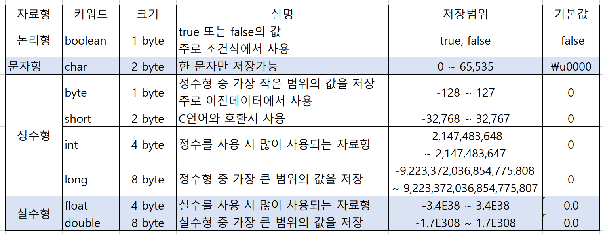
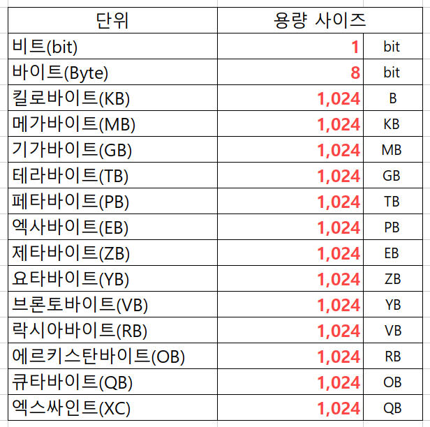
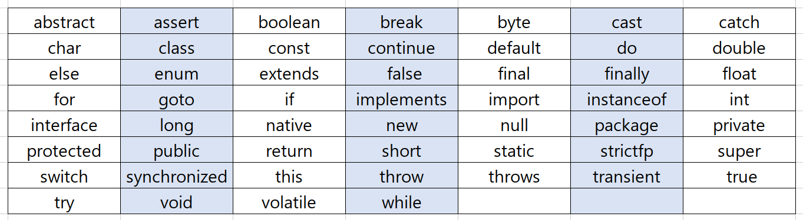

</img>

# 자료형(Data Type)
### Java Data Type (자바 자료형)
<pre>
  <code> 
     Primitive Type							: 기본형
              ㄴ Boolean Type(boolean)					: 논리형 
              ㄴ Numeric Type						: 숫자형
                    ㄴ Integral Type 					: 적분형
                          ㄴ Integer Type(short, int, long) 		: 정수형
                          ㄴ Floating Point Type(float, double) 	: 실수형
                    ㄴ Character Type(char) 				: 문자형
     Reference Type 							: 참조형
              ㄴ Class Type						: 객체형
              ㄴ Interface Type						: 결합형
              ㄴ Array Type						: 배열형
              ㄴ Enum Type						: 열거형
              ㄴ etc.							: 기타
  </code>
</pre>
</img>

### 데이터 용량 단위
</img>

### Reserved Word (예약어)
</img>

----
# Table of Contents
##### [0. 개발 준비](../../../../../../)
##### [1. 자바(Java)](../java)
#### 2. 자료형(Data Type)
##### [3. 변수(Variable)](../variable)
##### [4. 주석(Comments)](../comments)
##### [5. 연산자(Operator)](../operator)
##### [6. 조건문(Conditional)](../conditional)
##### [7. 반복문(Iteration)](../iteration)
##### [8. 배열(Array)](../array)
##### [9. 메소드(Method)](../method)
##### [10. 클래스(Class)](../classes)
##### [11. 패키지(Package)](../packages)
##### [12. 접근 제한자(Access Modifier)](../accessmodifier)
##### [13. 상속(Inheritance)](../inheritance)
##### [14. 추상(Abstract)](../abstracts)
##### [15. 인터페이스(Interface)](../interfaces)
##### [16. 예외 처리(Exception)](../exceptions)
##### [17. 참조(Reference)](../references)
##### [18. 제네릭(Generic)](../generics)
##### [19. 컬렉션(Collection)](../collections)
##### [20. 스트림(Stream)](../streams)
