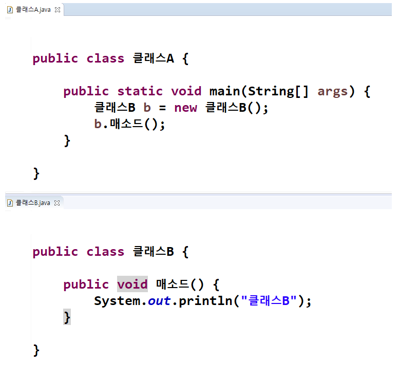
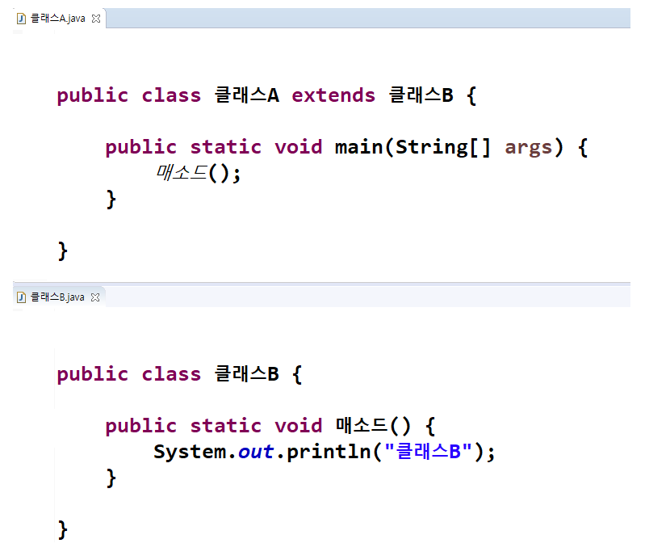

</img>

# 상속(Inheritance)
<pre>
  <code>
	상속이란 객체지향 언어에서 다형성(Polymorphism)을 구현 하기 위한 방법이다.
	이미 구성된 클래스의 기능을 그대로 사용 하거나 부분적으로 재구성 하여 재사용성을 극대화시킨다.
	부모 클래스는 추상(abstract) 메소드를 만들고 자식 클래스에서 구체적인 코드를 만들 수 있다.
  </code>
</pre>
> * [다형성](https://ko.wikipedia.org/wiki/%EB%8B%A4%ED%98%95%EC%84%B1_(%EC%BB%B4%ED%93%A8%ED%84%B0_%EA%B3%BC%ED%95%99))

### 생성자로 사용할 경우
</img>

### 상속으로 사용할 경우
</img>

----
# Table of Contents
##### [0. 개발 준비](../../../../../../)
##### [1. 자바(Java)](../java)
##### [2. 자료형(Data Type)](../datatype)
##### [3. 변수(Variable)](../variable)
##### [4. 주석(Comments)](../comments)
##### [5. 연산자(Operator)](../operator)
##### [6. 조건문(Conditional)](../conditional)
##### [7. 반복문(Iteration)](../iteration)
##### [8. 배열(Array)](../array)
##### [9. 메소드(Method)](../method)
##### [10. 클래스(Class)](../classes)
##### [11. 패키지(Package)](../packages)
##### [12. 접근 제한자(Access Modifier)](../accessmodifier)
#### 13. 상속(Inheritance)
##### [14. 추상(Abstract)](../abstracts)
##### [15. 인터페이스(Interface)](../interfaces)
##### [16. 예외 처리(Exception)](../exceptions)
##### [17. 참조(Reference)](../references)
##### [18. 제네릭(Generic)](../generics)
##### [19. 컬렉션(Collection)](../collections)
##### [20. 스트림(Stream)](../streams)
