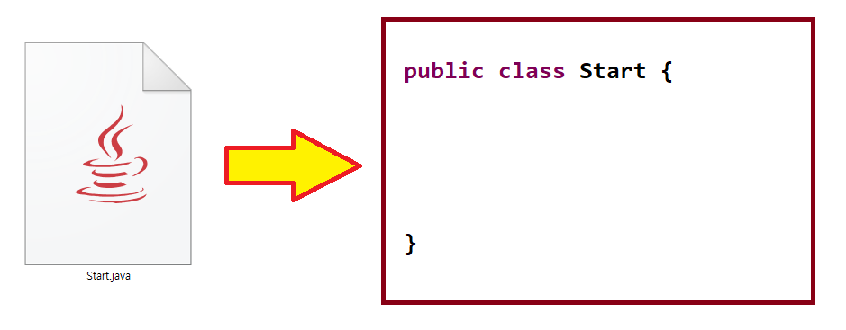
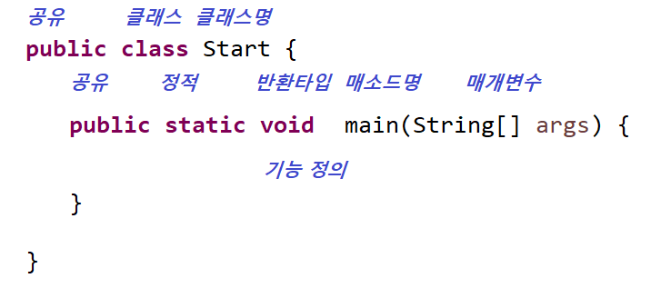
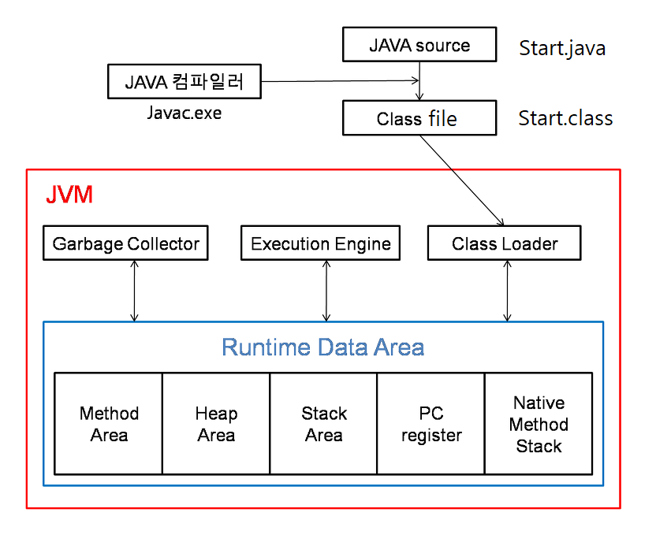
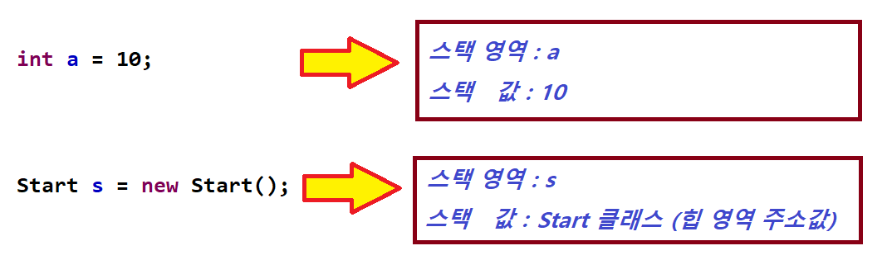

</img>

# Java Start
### java 파일 사용법 4가지 조건 
<pre>
  <code>
	 1. 클래스(class)당 파일(file) 1개
	 2. 파일명과 클래스명은 동일해야한다. (대소문자 구분)
	 3. 클래스명은 항상 첫번째 글자는 대문자로 사용한다. (Start "O", start "X") 
	 4. 항상 작성하는 코드는 클래스 속에 만들다. 단, 외부 코드나 package는 밖에 있을 수 있다.
  </code>
</pre>
</img>

### 프로그램 시작은?
<pre>
  <code>	  
	 1. main 매소드 (함수)가 존재 해야 한다.
	 2. main 매소드가 규칙이 있고 형태는 아래와 같다.
	 3. main 매소드명은 변경이 불가하다.
	 4. main 매소드 실행 시 입력 받은 변수가 존재 해야 한다.
  </code>
</pre>
</img>

### 프로그램 동작은 어디서 하나요?
<pre>
  <code>	  
	 1. Java 프로그램은 운영체제에서 동작하는 JVM에서 동작한다.
	 2. JVM(자바 가상 머신)은 Java 프로그램을 바이트 코드로 실행 할수 있도록 구현한 도구
	 3. JVM은 모든 운영체제에 설치 실행이 가능하다.
	 4. Java 프로그램이 JVM에서 동작하기 위한 흐름은 아래와 같다.
  </code>
</pre>
</img>

### JVM(Java Virtual Machine)
<pre>
  <code>	  
	 1. Class Loader : "Start.java -> Start.class" 파일를 
			JVM이 운영체제에게 할당받은 메모리영역에 생성하는 역할를 한다. 
	 2. Execution Engine : 메모리영역에 생성된 클래스를 기계어로 
			변경해 명령어 단위로 실행하는 역할를 한다.
	 3. Garbage Collector : Heap 메모리 영역에 생성된 객체들 중 
			참조되지 않는 객체들을 탐색 후 제거하는 역할를 한다.
	 4. Runtime Data Area : JVM 메모리 영역으로 자바 애플리케이션을 
			실행할 때 사용되는 데이터들을 생성하는 영역이다.
  </code>
</pre>

##### Method area (메소드 영역)
<pre>
  <code>	  
	클래스 멤버 변수의 이름, 데이터 타입, 접근 제어자 정보같은 필드 정보와 메소드의 이름, 리턴 타입, 파라미터, 
	접근 제어자 정보같은 메소드 정보, Type정보(Interface인지 class인지), 
	Constant Pool(상수 풀 : 문자 상수, 타입, 필드, 객체 참조가 저장됨), static 변수, 
	final class 변수등이 생성되는 영역이다.
  </code>
</pre>

##### Heap area (힙 영역)
<pre>
  <code>	  
	new 키워드로 생성된 객체와 배열이 생성되는 영역이다.
	메소드 영역에 로드된 클래스만 생성이 가능하며, 
	Garbage Collector가 참조되지 않는 메모리를 확인하고 제거하는 영역이다.
  </code>
</pre>

##### Stack area (스택 영역)
<pre>
  <code>	  
	지역 변수, 파라미터, 리턴 값, 연산에 사용되는 임시 값등이 생성되는 영역이다.
	메소드를 호출할 때마다 개별적으로 스택이 생성된다.
	클래스 생성 시 스택 영역에 생성된 "s"가 힙 영역에 생성된 객체를 가리키고(참조하고) 있는 것이다.
	아래의 코드와 같이 생성되는 영역을 말한다.
  </code>
</pre>
</img>

##### PC Register (PC 레지스터)
<pre>
  <code>	  
	Thread(쓰레드)가 생성될 때마다 생성되는 영역으로 Program Counter 
	즉, 현재 쓰레드가 실행되는 부분의 주소와 명령을 저장하고 있는 영역이다. (*CPU의 레지스터와 다름)
	이것을 이용해서 쓰레드를 돌아가면서 수행할 수 있게 한다.
  </code>
</pre>

##### Native method stack
<pre>
  <code>	  
	자바 외 언어로 작성된 네이티브 코드를 위한 메모리 영역이다.
	보통 C/C++등의 코드를 수행하기 위한 스택이다. (JNI)
  </code>
</pre>

----
# Table of Contents
##### [0. 개발 준비](../../../../../../)
#### 1. 자바(Java)
##### [2. 자료형(Data Type)](../datatype)
##### [3. 변수(Variable)](../variable)
##### [4. 주석(Comments)](../comments)
##### [5. 연산자(Operator)](../operator)
##### [6. 조건문(Conditional)](../conditional)
##### [7. 반복문(Iteration)](../iteration)
##### [8. 배열(Array)](../array)
##### [9. 메소드(Method)](../method)
##### [10. 클래스(Class)](../classes)
##### [11. 패키지(Package)](../packages)
##### [12. 접근 제한자(Access Modifier)](../accessmodifier)
##### [13. 상속(Inheritance)](../inheritance)
##### [14. 추상(Abstract)](../abstracts)
##### [15. 인터페이스(Interface)](../interfaces)
##### [16. 예외 처리(Exception)](../exceptions)
##### [17. 참조(Reference)](../references)
##### [18. 제네릭(Generic)](../generics)
##### [19. 컬렉션(Collection)](../collections)
##### [20. 스트림(Stream)](../streams)
