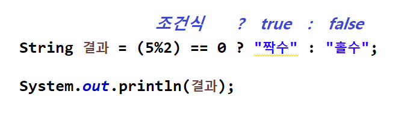

</img>

# 연산자(Operator)
### 산술 연산자
<pre>
  <code>
	 산술(算셈산 術재주술, Arithmetic)연산자는 수학적인 계산에 사용되는 연산자다.
	 수학에서 사용하는 연산자와 프로그래밍에서 사용하는 연산자는 기호의 모양이 조금 다르다.
  </code>
</pre>
</img>

### 단항 연산자
<pre>
  <code>
	 1+2에서 사용한 연산자 +는 이항(二두이 項항목항, infix operator) 연산자이고, 
	 좌항인 1과 우항인 2를 더해주는 작업을 하고 있다. 
	 단항(單홑단 項항목항, unary) 연산자는 하나의 항을 대상으로 연산이 이루어지는 연산자이다.
  </code>
</pre>
</img>

### 삼항 연산자
<pre>
  <code>
	 if else를 한번에 처리 하기 위한 방법으로 true의 결과와 false의 결과에 대한 정의를 한다.
	 조건식의 연산결과에 따라 두가지 결과를 반환 하게 만들 수 있다.
  </code>
</pre>
</img>

----
# Table of Contents
##### [0. 개발 준비](../../../../../../)
##### [1. 자바(Java)](../java)
##### [2. 자료형(Data Type)](../datatype)
##### [3. 변수(Variable)](../variable)
##### [4. 주석(Comments)](../comments)
#### 5. 연산자(Operator)
##### [6. 조건문(Conditional)](../conditional)
##### [7. 반복문(Iteration)](../iteration)
##### [8. 배열(Array)](../array)
##### [9. 메소드(Method)](../method)
##### [10. 클래스(Class)](../classes)
##### [11. 패키지(Package)](../packages)
##### [12. 접근 제한자(Access Modifier)](../accessmodifier)
##### [13. 상속(Inheritance)](../inheritance)
##### [14. 추상(Abstract)](../abstracts)
##### [15. 인터페이스(Interface)](../interfaces)
##### [16. 예외 처리(Exception)](../exceptions)
##### [17. 참조(Reference)](../references)
##### [18. 제네릭(Generic)](../generics)
##### [19. 컬렉션(Collection)](../collections)
##### [20. 스트림(Stream)](../streams)
