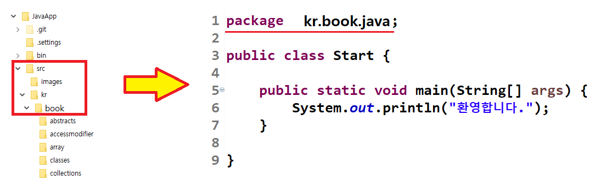

</img>

# 패키지(Package)
<pre>
  <code>
	자바(Java) 코드를 하나의 프로젝트(그룹)으로 만들기 위한 구조 경로를 말한다.
	클래스 생성 시 자바 파일을 생성하기 때문에 일반 파일과 동일하게 관리 할 수 있다.
	패키지 구성은 폴더와 폴더 관계를 나타내기 위하여 '.'을 사용하여 구분한다.
  </code>
</pre>

### 패키지 구성
</img>

----
# Table of Contents
##### [0. 개발 준비](../../../../../../)
##### [1. 자바(Java)](../java)
##### [2. 자료형(Data Type)](../datatype)
##### [3. 변수(Variable)](../variable)
##### [4. 주석(Comments)](../comments)
##### [5. 연산자(Operator)](../operator)
##### [6. 조건문(Conditional)](../conditional)
##### [7. 반복문(Iteration)](../iteration)
##### [8. 배열(Array)](../array)
##### [9. 메소드(Method)](../method)
##### [10. 클래스(Class)](../classes)
#### 11. 패키지(Package)
##### [12. 접근 제한자(Access Modifier)](../accessmodifier)
##### [13. 상속(Inheritance)](../inheritance)
##### [14. 추상(Abstract)](../abstracts)
##### [15. 인터페이스(Interface)](../interfaces)
##### [16. 예외 처리(Exception)](../exceptions)
##### [17. 참조(Reference)](../references)
##### [18. 제네릭(Generic)](../generics)
##### [19. 컬렉션(Collection)](../collections)
##### [20. 스트림(Stream)](../streams)
