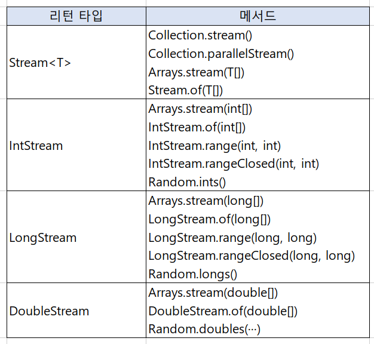

</img>

# 스트림(Stream)
<pre>
  <code>
	스트림은 자바 8부터 추가된 기능으로 "컬렉션, 배열등의 저장 요소를 하나씩 참조하며 
	함수형 인터페이스(람다식)를 적용하며 반복적으로 처리할 수 있도록 해주는 기능"을 말한다.
	병렬 처리(Parallel Procession)가 가능한 스트림은 대용량 데이터들을 빠르게 처리 가능
	스트림 처리 단계는 크게 세 가지로 나눌 수 있다.
	1. 생성하기 : 스트림 인스턴스 생성
	2. 가공하기 : 필터링 및 맵핑 등 원하는 결과를 만들어가는 중간 작업
	3. 결과 만들기 : 최종적으로 결과를 만들어내는 작업
  </code>
</pre>

# 스트림의 종류
</img>

----
# Table of Contents
##### [0. 개발 준비](../../../../../../)
##### [1. 자바(Java)](../java)
##### [2. 자료형(Data Type)](../datatype)
##### [3. 변수(Variable)](../variable)
##### [4. 주석(Comments)](../comments)
##### [5. 연산자(Operator)](../operator)
##### [6. 조건문(Conditional)](../conditional)
##### [7. 반복문(Iteration)](../iteration)
##### [8. 배열(Array)](../array)
##### [9. 메소드(Method)](../method)
##### [10. 클래스(Class)](../classes)
##### [11. 패키지(Package)](../packages)
##### [12. 접근 제한자(Access Modifier)](../accessmodifier)
##### [13. 상속(Inheritance)](../inheritance)
##### [14. 추상(Abstract)](../abstracts)
##### [15. 인터페이스(Interface)](../interfaces)
##### [16. 예외 처리(Exception)](../exceptions)
##### [17. 참조(Reference)](../references)
##### [18. 제네릭(Generic)](../generics)
##### [19. 컬렉션(Collection)](../collections)
#### 20. 스트림(Stream)
