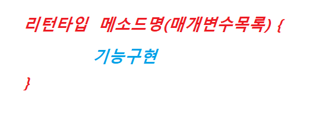
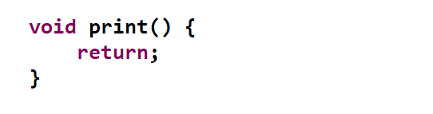
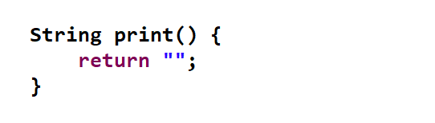
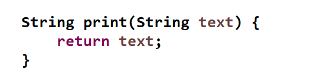

</img>

# 메소드(Method)
<pre>
  <code>
	 메소드는 코드를 재사용할 수 있게 하는 방법이다.
	 중복 코드 혹은 공통으로 사용 될 코드를 정의 할때 이용한다.
	 기능별 역할를 구분하기 위하여 사용 하기도 한다.
  </code>
</pre>

### 메소드 구조
</img>

### 리턴타입이 필요없을 경우 (void) 
</img>

### 리턴타입이 필요한 경우 (자료형)
</img>

### 매개변수가 필요한 경우 (변수 선언)
</img>

----
# Table of Contents
##### [0. 개발 준비](../../../../../../)
##### [1. 자바(Java)](../java)
##### [2. 자료형(Data Type)](../datatype)
##### [3. 변수(Variable)](../variable)
##### [4. 주석(Comments)](../comments)
##### [5. 연산자(Operator)](../operator)
##### [6. 조건문(Conditional)](../conditional)
##### [7. 반복문(Iteration)](../iteration)
##### [8. 배열(Array)](../array)
#### 9. 메소드(Method)
##### [10. 클래스(Class)](../classes)
##### [11. 패키지(Package)](../packages)
##### [12. 접근 제한자(Access Modifier)](../accessmodifier)
##### [13. 상속(Inheritance)](../inheritance)
##### [14. 추상(Abstract)](../abstracts)
##### [15. 인터페이스(Interface)](../interfaces)
##### [16. 예외 처리(Exception)](../exceptions)
##### [17. 참조(Reference)](../references)
##### [18. 제네릭(Generic)](../generics)
##### [19. 컬렉션(Collection)](../collections)
##### [20. 스트림(Stream)](../streams)
