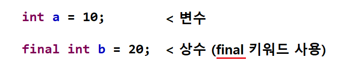

</img>

# 변수(Variable)
### 자바 변수 종류
<pre>
  <code>
	 기본형 변수 : 논리형, 문자형, 정수형, 실수형
	 참조 변수 : 값이 저장되어 있는 주소값을 가진다.
	 멤버 변수 : 클래스 변수, 인스턴스 변수 두가지를 모두 나타내는 변수
	 클래스 변수 : 인스턴스 변수를 static(정적)으로 사용 또는 값을 공유하는 변수
	 인스턴스 변수 : 클래스 영역에 선언되고 인스턴스 생성시 만들어진다. 
	 지역 변수 : 메소드 내에 선언되며 메소드 호출 시 생성 후 메소드 종료되면 사라진다.
	 매개 변수 : 파라미터로 불리며 메소드에서 입력값을 받을 때 사용 되는 변수
  </code>
</pre>

### 변수와 상수
<pre>
  <code>
	 변수 : 단 하나의 값을 저장할 수 있는 메모리 공간 (나중에 값을 변경하게 되면 기존에 저장되어 있던 값이  
	           지워지고 가장 마지막에 수정한 값이 변수의 값이 된다.)
	 상수 : 처음에 정해놓은 값이 바뀌지 않고 끝까지 고정 되는 값 (중간에 수정 불가, 선언할 때 초기화하지 않았다면
	           한번 값을 정의 할 수 있다.)
  </code>
</pre>
</img>

----
# Table of Contents
##### [0. 개발 준비](../../../../../../)
##### [1. 자바(Java)](../java)
##### [2. 자료형(Data Type)](../datatype)
#### 3. 변수(Variable)
##### [4. 주석(Comments)](../comments)
##### [5. 연산자(Operator)](../operator)
##### [6. 조건문(Conditional)](../conditional)
##### [7. 반복문(Iteration)](../iteration)
##### [8. 배열(Array)](../array)
##### [9. 메소드(Method)](../method)
##### [10. 클래스(Class)](../classes)
##### [11. 패키지(Package)](../packages)
##### [12. 접근 제한자(Access Modifier)](../accessmodifier)
##### [13. 상속(Inheritance)](../inheritance)
##### [14. 추상(Abstract)](../abstracts)
##### [15. 인터페이스(Interface)](../interfaces)
##### [16. 예외 처리(Exception)](../exceptions)
##### [17. 참조(Reference)](../references)
##### [18. 제네릭(Generic)](../generics)
##### [19. 컬렉션(Collection)](../collections)
##### [20. 스트림(Stream)](../streams)
